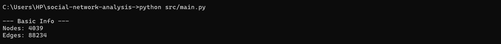
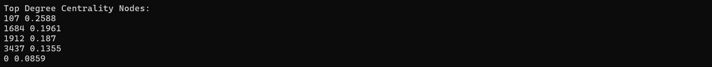
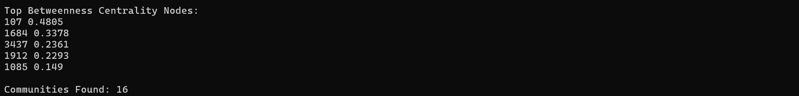

## Output Network Information

The output shows the size of the Facebook network used in analysis.
- There are 4039 users in the Facebook network
- There are 88,234 connections (friendships)

This output shows the most influential nodes based on degree centrality.
- Node **107** has the highest degree centrality → most connected user  
- Node **1684** and **1912** also show high connectivity  
- These nodes represent highly active or popular users in the network

The output shows the most influential bridge nodes and detected communities.
- Node **107** has highest betweenness → strongest bridge  
- Nodes **1684** and **3437** connect different communities  
- **16 communities** detected → strong clustering in network  
